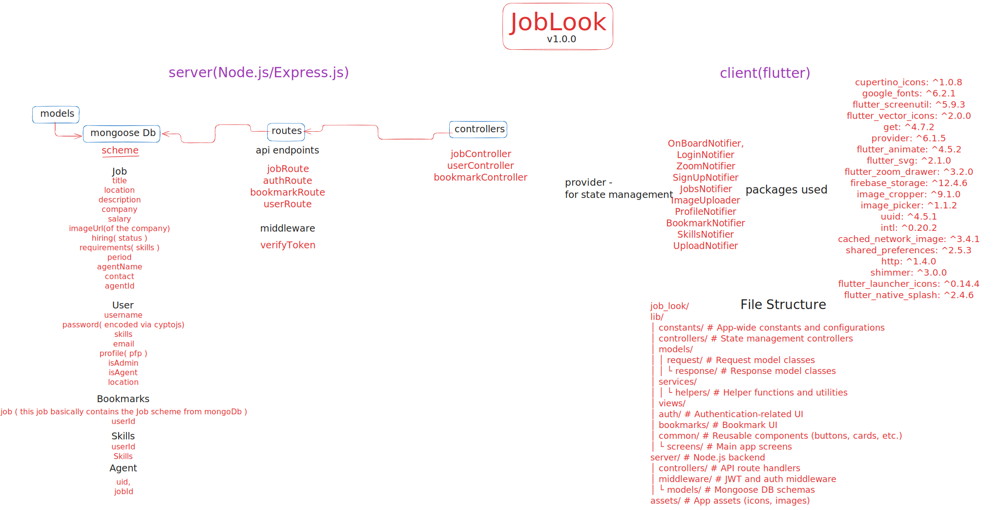
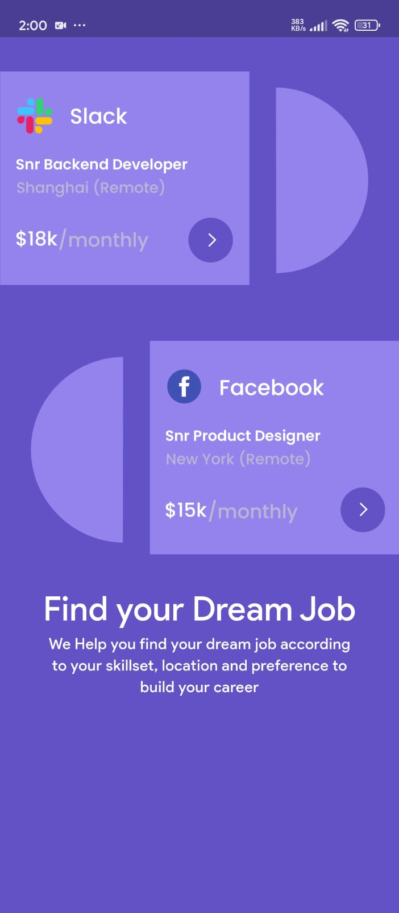
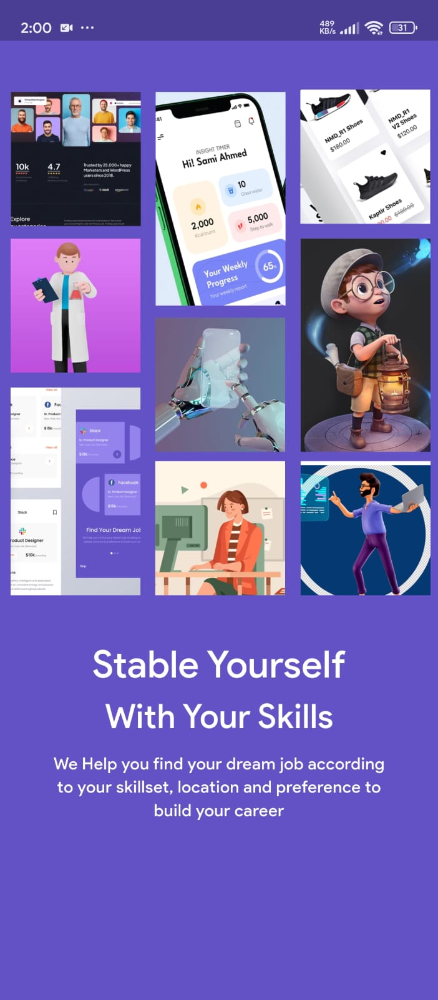
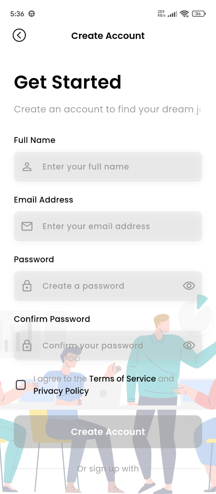
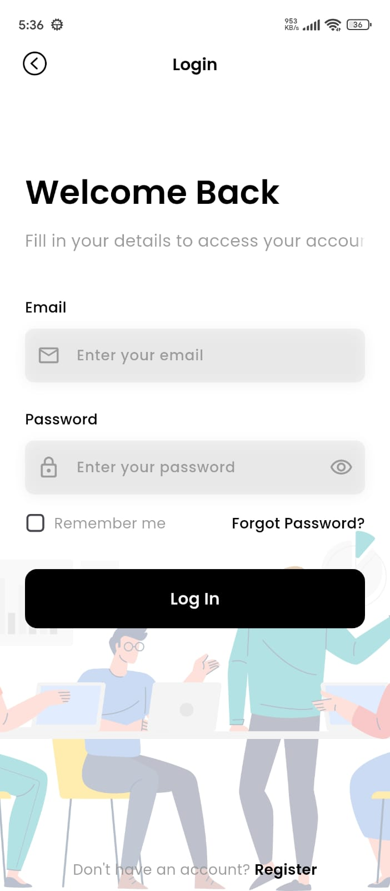
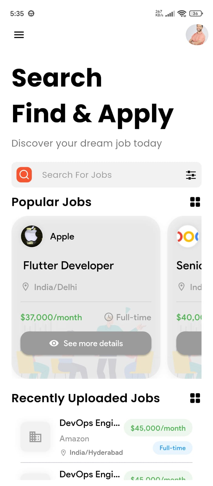
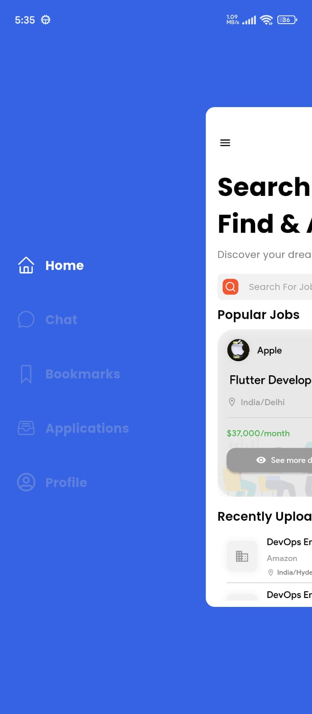
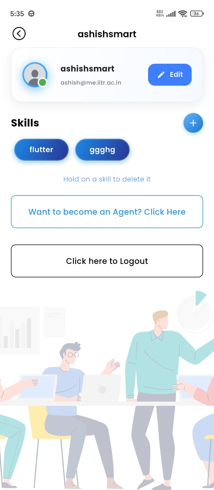
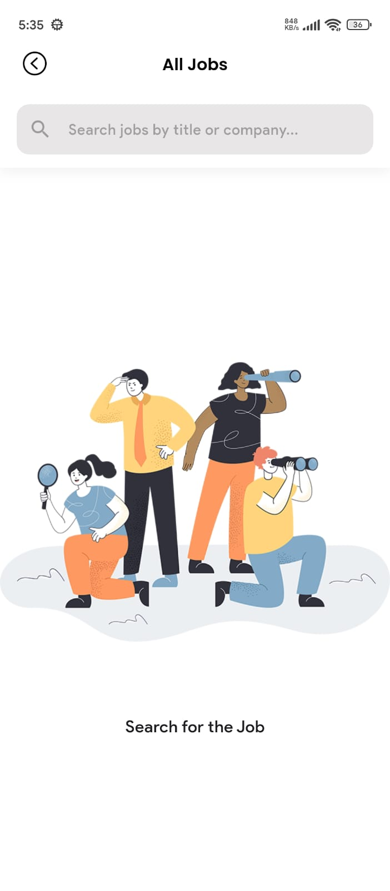
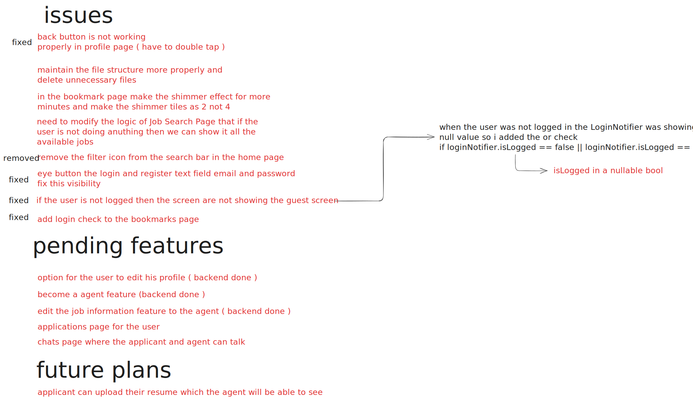

# 🔍 JobLook - Mobile Job Search Application

**Find Your Dream Job with JobLook**

JobLook is a comprehensive mobile job search application built using **Flutter** for the frontend and **Node.js** for the backend. It connects job seekers with employers, allowing users to search, apply, and bookmark jobs, while agents (recruiters) can post, edit, and manage job listings.

---

## ✨ Features

* 🔐 **User Authentication**: Secure login/signup with profile management
* 🔎 **Job Search**: Filter and explore jobs based on category, location, and keywords
* 📌 **Bookmark System**: Save interesting jobs for future reference
* 👥 **Dual Role System**: Separate permissions for users and agents
* 📝 **Job Management**: Agents can post, edit, and delete job listings
* 👨‍💼 **Profile Management**: Update your personal info and professional skills
* 📱 **Responsive UI**: Clean, modern design optimized for all screen sizes
---
## 🏗️ Architecture Diagram
<div align="center">
    
    <p><em>JobLook Application Architecture</em></p>
</div>

---
## 📸 Screenshots
<table>
    <tr>
        <td align="center">
            <br>
            <em>Login Screen</em>
        </td>
        <td align="center">
            <br>
            <em>Home Screen</em>
        </td>
        <td align="center">
            <br>
            <em>Job Details</em>
        </td>
    </tr>
    <tr>
        <td align="center">
            <br>
            <em>Profile Screen</em>
        </td>
        <td align="center">
            <br>
            <em>Bookmarks Screen</em>
        </td>
        <td align="center">
            <br>
            <em>Search Results</em>
        </td>
    </tr>
    <tr>
        <td align="center">
            <br>
            <em>Upload Job Screen</em>
        </td>
        <td align="center">
            <br>
            <em>Skills Management</em>
        </td>
        <td align="center">
            <br>
            <em>Onboarding Screen</em>
        </td>
    </tr>
</table>

---
## ⚠️ Known Issues & Pending Features
<div align="center">
    
    <p><em>JobLook Application Architecture</em></p>
</div>

---
## 🧰 Tech Stack

| Layer          | Technology                 |
| -------------- | -------------------------- |
| **Frontend**   | Flutter (Dart)             |
| **Backend**    | Node.js, Express           |
| **Database**   | MongoDB                    |
| **Storage**    | Firebase Storage (images)  |
| **Auth**       | JWT (JSON Web Token)       |
| **State Mgmt** | Provider Pattern (Flutter) |

---

## ⚙️ Installation & Setup

### ✅ Prerequisites

* Flutter SDK (>= 3.7.2)
* Dart SDK (>= 3.7.2)
* Node.js (>= 14.x)
* MongoDB (running locally or cloud-based)
* Firebase account (for image storage)

---

### 📱 Frontend (Flutter)

```bash
# Clone the repository
git clone https://github.com/yourusername/job_look.git
cd job_look

# Install dependencies
flutter pub get

# Configure environment variables
# Create a `.env` file and set your API base URL and Firebase credentials

# Run the app
flutter run
```

---

### 🌐 Backend (Node.js)

```bash
# Navigate to server folder
cd server

# Install backend dependencies
npm install

# Configure environment variables
# Create a `.env` file with:
# - MONGODB_URI
# - JWT_SECRET
# - Firebase credentials

# Start the server
npm start
```

---

## 🗂 Project Structure

```text
job_look/
🔽 lib/
│   🔽 constants/          # App-wide constants and configurations
│   🔽 controllers/        # State management controllers
│   🔽 models/
│   │   🔽 request/        # Request model classes
│   │   └️ response/       # Response model classes
│   🔽 services/
│   │   └️ helpers/        # Helper functions and utilities
│   🔽 views/
│       🔽 auth/           # Authentication-related UI
│       🔽 bookmarks/      # Bookmark UI
│       🔽 common/         # Reusable components (buttons, cards, etc.)
│       └️ screens/        # Main app screens
🔽 server/                 # Node.js backend
│   🔽 controllers/        # API route handlers
│   🔽 middleware/         # JWT and auth middleware
│   └️ models/             # Mongoose DB schemas
🔽 assets/                 # App assets (icons, images)
```

---

## 🔐 Key Implementation Details

* **JWT Authentication**: Secure user sessions and role handling
* **Role-Based Access**: Access control for agents and regular users
* **Firebase Storage**: Profile and company logos/image uploads
* **Provider Pattern**: Centralized state management
* **flutter\_screenutil**: For pixel-perfect responsiveness on all devices

---

## 🤝 Contributing

Contributions are welcome and appreciated!

1. Fork the project
2. Create your feature branch: `git checkout -b feature/AmazingFeature`
3. Commit your changes: `git commit -m 'Add some AmazingFeature'`
4. Push to the branch: `git push origin feature/AmazingFeature`
5. Open a Pull Request ✅

---

## 📜 License

This project is licensed under the **MIT License** – see the [LICENSE](LICENSE) file for details.

---
## 📧 Contact
Your Name - @ashishexee - ashish@me.iitr.ac.in

Project Link: https://github.com/ashishexee/JobLook

## 💙 Made with Love

Built with ❤️ using **Flutter** and **Node.js**